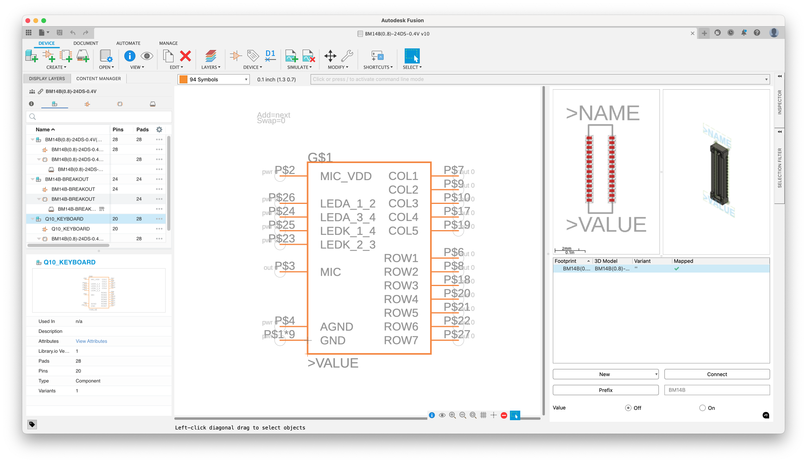
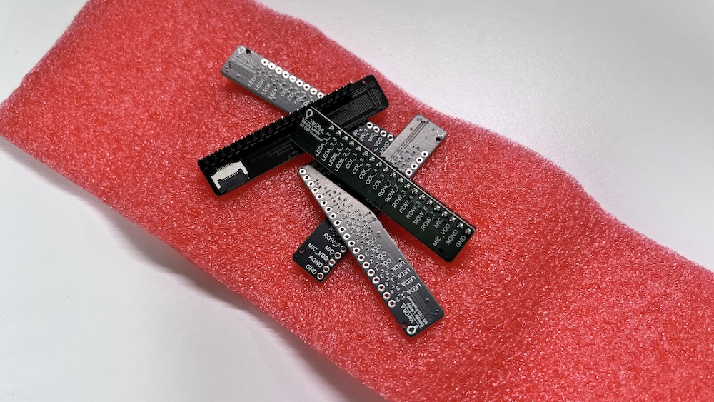
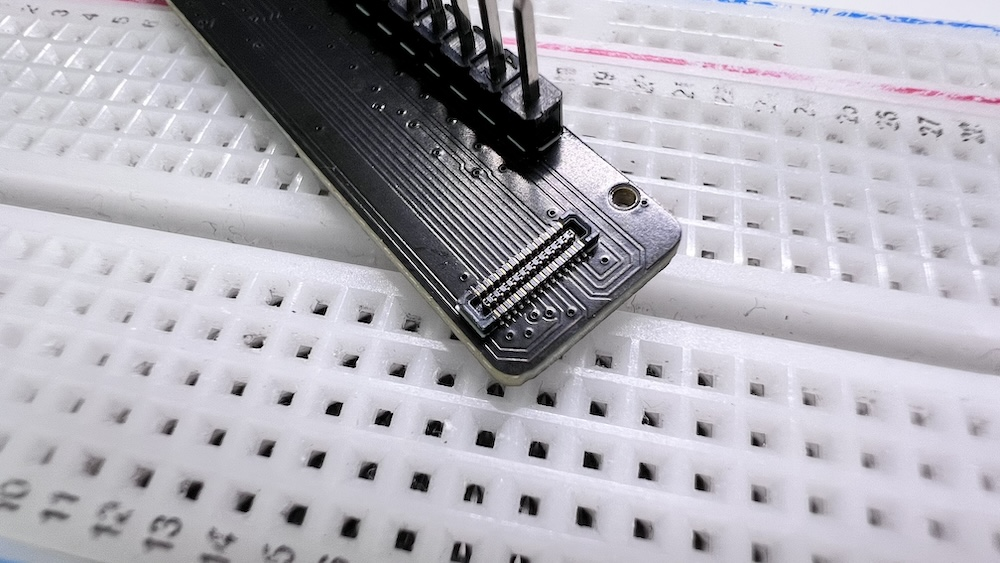

# Eagle and Fusion Library for BlackBerry Q10 Keyboard Connector

This library is forked from [here](https://github.com/robert-kuramshin/BM14B-eagle), and I added a pinout for better use.

## real-world test

